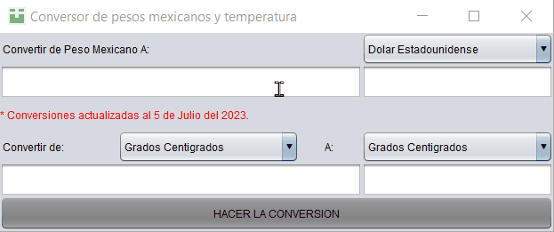
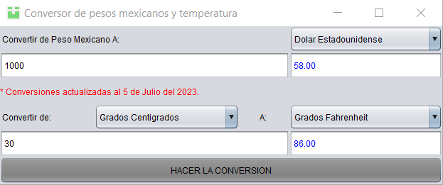
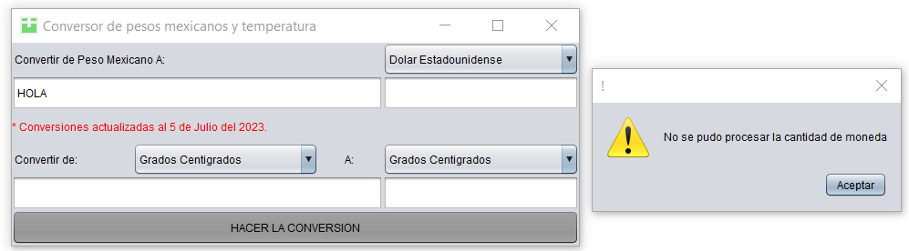
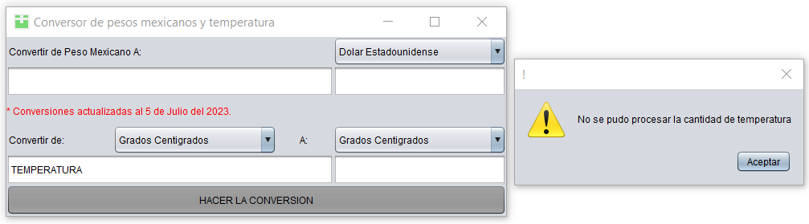

# Conversor de moneda y temperatura

## Uso

Al iniciar el programa se debe llenar con números alguno o ambos campos de texto de la izquierda.

Después seleccionar de las listas deplegables a que se quiere convertir el valor.

## Resultados al usar el programa

Mostrará en los campos de texto de la derecha de color azul el valor convertido.

Se ralizará la conversión si se introdujeron números. Mostrará un mensaje cuando se agrega un valor diferente.

## Construido con

Fue usado Java JDK versión 8. Se puede encontrar aquí.

https://www.oracle.com/java/technologies/downloads/#java8

## Licencia

Licencia MIT.